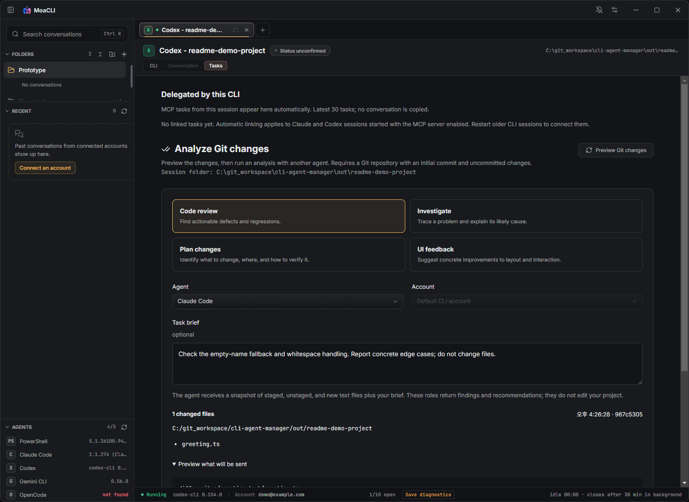

<p align="center">
  
</p>

<h1 align="center">MoaCLI</h1>

<p align="center">
  Run, organize, and resume multiple coding-agent CLIs from one Windows desktop workspace.
</p>

<p align="center">
  
  
  
  
</p>

<p align="center">
  <a href="https://github.com/shb990407-cyber/moacli/releases/latest/download/MoaCLI-Setup.exe">
    
  </a>
</p>

<p align="center">
  
</p>

MoaCLI keeps the native interactive experience of each CLI while adding a shared launcher, isolated account profiles, persistent conversation organization, and fast switching between live terminals.

**New here?** [Quick start](#quick-start) · [Common problems](#common-problems) · [한국어 시작 안내](./docs/GETTING_STARTED_KO.md)

MoaCLI is a Windows desktop workspace for CLIs you already use. Install and sign in to at least one supported coding CLI separately; MoaCLI does not bundle the agents or provide model access. You can also start with PowerShell to try the terminal without an AI account.

## Highlights

- Run real interactive CLIs through `node-pty` and xterm.js.
- Keep up to 10 terminal sessions open and switch between them without restarting a CLI.
- Resume local Claude, Codex, Gemini, and OpenCode conversations from one recent-history list.
- Search local Claude and Codex message content with `Ctrl+K` and jump directly to the matching message.
- View the native CLI and the locally stored conversation transcript in separate tabs.
- Detect verified Claude, Codex, and Gemini accounts from their local CLI configuration.
- Isolate multiple Claude and Codex accounts with separate configuration directories.
- Organize conversations and live sessions into resizable, reorderable logical folders.
- Paste text, screenshots, and copied image files into the active CLI with `Ctrl+V`.
- Customize agent icons with monograms, Lucide icons, PNG images, and background colors.
- Customize interface and terminal fonts, including locally installed Windows fonts, plus independent accent, background, and foreground colors.
- Receive approval, input, and response-completion notifications where supported by the CLI integration.
- Review Git changes and track delegated work in the Tasks tab.
- Choose default worker models and override a model when manually approving a delegated task.
- Keep typing responsive under competing terminal output with bounded output scheduling and PTY backpressure.
- Detect installed CLI versions and refresh them without restarting MoaCLI.

## Supported Agents

| Agent | Interactive terminal | Local history and resume | Account discovery | Isolated account directory |
| --- | :---: | :---: | :---: | --- |
| PowerShell | Yes | No | Not required | Not required |
| Claude Code | Yes | Yes | Yes | `CLAUDE_CONFIG_DIR` |
| Codex | Yes | Yes | Yes | `CODEX_HOME` |
| Gemini CLI | Yes | Yes | Yes | Not currently configured |
| OpenCode | Yes | Yes | No | Not currently configured |

MoaCLI uses each agent's installed executable and native resume command. It does not replace or emulate the CLI itself.

## Quick Start

### 1. Prepare a CLI

Use Windows 10/11 **x64**. macOS support is planned; there is no supported macOS installer yet.

Install the agent you want to use and complete its own sign-in/setup once in a normal Windows terminal. Follow the provider's current instructions:

| CLI | Official installation and setup | Check from PowerShell |
| --- | --- | --- |
| Claude Code | [Quickstart](https://code.claude.com/docs/en/quickstart) | `claude --version` |
| Codex | [Codex CLI](https://developers.openai.com/codex/cli/) | `codex --version` |
| Gemini CLI | [Installation](https://geminicli.com/docs/get-started/installation/) | `gemini --version` |
| OpenCode | [Getting started](https://opencode.ai/docs/) | `opencode --version` |

Only your chosen CLI is required. Confirm it launches from Windows PowerShell; a CLI installed only inside WSL may not be available to MoaCLI's Windows launcher. Provider accounts, usage limits and any charges remain with the selected CLI/provider.

### 2. Install MoaCLI

[Download MoaCLI-Setup.exe](https://github.com/shb990407-cyber/moacli/releases/latest/download/MoaCLI-Setup.exe), run it, then open **MoaCLI** from the Start menu or desktop shortcut. The installer lets you choose its installation directory.

The Windows installer includes MoaCLI's runtime; you do not need to clone this repository or install Node.js just to run MoaCLI. Individual CLIs can have their own prerequisites. Current Windows builds are not code-signed, so SmartScreen may show **Unknown publisher**.

### 3. Start your first session

1. Choose an available agent on **Start a new session**. To try the app without AI setup, choose **PowerShell**.
2. Leave **Automatic (default)** selected for the title. Use **Custom title** only if you want a fixed name.
3. Click **Change** beside the path and choose the project directory the agent should work in.
4. Leave **Folder** as **Unsorted** for now. This is a sidebar category, not another filesystem directory.
5. Choose a detected account, or use **No account connected yet — set one up** to open account settings. PowerShell needs no account.
6. Press **Start**. Complete any trust/sign-in prompts shown by the CLI, then type your request in the **CLI** tab.

For a first AI request, try: “Explain this project's folder structure without changing files.” With PowerShell, enter `Get-Location` to confirm the selected working directory.


Actual Windows app capture, v0.1.35, using an isolated demo profile. The PowerShell example needs no AI account.

**Codex status setup:** on a new MoaCLI Codex terminal using Codex 0.154.0+, open `/hooks` and trust the MoaCLI observer entries when prompted. Until then, MoaCLI may show **Status unconfirmed** or only generic attention notifications. Hook trust and command permissions are separate settings; see [notifications and permissions](#notifications-and-codex-permissions).

## Using MoaCLI

### Start a new session

Use **+ / New session** to open the launcher again. You can keep up to 10 terminals open. Switching tabs keeps the existing CLI process running; it does not start a second copy.

Automatic titles follow the CLI's saved title when available. A custom title is kept by MoaCLI when reopening that conversation. [Title behavior](./docs/SESSION_TITLES.md)

A background session can be removed from the in-memory list after 30 minutes without viewing or input/output activity. The active session and sessions with pending notifications are retained. This is not deletion of the CLI's saved conversation history.

### Understand the workspace

| Area | What it is for |
| --- | --- |
| **CLI** | The live terminal: type requests, answer questions and accept CLI approvals here. |
| **Conversation** | Read the transcript saved by the CLI. It can lag behind live output until the CLI writes its history. |
| **Tasks** | In an AI-agent session, preview Git changes, run analysis roles and inspect delegated-task results. PowerShell sessions do not have this tab. |
| **Folders** | Group sessions in the sidebar. Moving a session between groups does not move project files. |
| **Recent** | Find locally saved conversations and reopen them with their native resume command. |
| **Bell / Notifications** | Find sessions waiting for attention or reporting an outcome, where the integration supports it. |

### Resume a conversation

1. Select a conversation under **Recent**.
2. MoaCLI opens the matching account, working directory, and native resume ID.
3. Use the **CLI** tab to continue working or **Conversation** to read the local transcript.

Closing MoaCLI stops its running terminals. After reopening the app, choose a saved conversation under **Recent** and open **CLI** to resume it; live processes are not restored automatically.

Recent conversations are read from the CLI-owned local history. If a conversation is removed through its original CLI, MoaCLI reconciles the list on the next history refresh.

Press `Ctrl+K` and type at least two characters to search indexed Claude and Codex messages. Selecting a result opens the transcript at the matching message without starting the CLI; select the **CLI** tab only when you want to resume the agent.

### Use multiple accounts

Open **Settings**, add an account, select the agent, and assign a dedicated configuration directory. Accounts are identified by the combination of agent type and normalized configuration directory, so Claude and Codex may use the same email without colliding.

The email is display metadata. Authentication is controlled by the official CLI state inside the selected configuration directory. A single directory cannot hold two simultaneous identities for the same agent; signing in again replaces that directory's active credentials.

Automatically detected accounts are read-only. Manually added profiles can be edited or removed. After browser login, use the refresh action next to the login session close button to verify and update the account email.

### Paste images

Press `Ctrl+V` inside the terminal:

- Clipboard text is inserted as text.
- A copied bitmap is saved as a temporary PNG and inserted as a quoted path.
- Image files copied from Windows Explorer are inserted as quoted paths.
- Enter is never sent automatically.

### Notifications and Codex permissions

Open **Settings → Notifications** to choose which supported events create in-app or Windows notifications. Approval/input requests are answered in the session's **CLI** tab. Event coverage differs by CLI and version; detailed approval/completion integration is available for supported Claude and Codex versions. [Event setup and limits](./docs/AGENT_EVENTS.md)

In **Settings → CLI permissions**, **CLI default** leaves Codex's permission choice to the CLI. **Full access (no approvals or sandbox)** applies to the next new or resumed Codex terminal and removes those command restrictions. Changing the setting does not reconfigure an already-running terminal, trust observer hooks, or change delegated-worker permissions.

### Tasks: analyze changes or delegate work

**Tasks has two workflows.** Start with **Analyze Git changes** if you simply want a second opinion on code you have changed. [한국어 Tasks 상세 안내](./docs/TASKS_GUIDE_KO.md)

| Workflow | How it starts | What the worker receives | Can it edit files? |
| --- | --- | --- | --- |
| **Analyze Git changes** | You preview changes and press **Run analysis** | Captured uncommitted text changes and your Task brief | No; returns findings or recommendations |
| **Delegated by this CLI** | Your connected Claude/Codex session calls a MoaCLI delegation tool | The task request and access allowed by its analysis/edit mode | Only when the task uses file-editing mode |



Actual v0.1.35 Tasks screen with a sample Git project and an example account label. No AI analysis was submitted for this capture. [See the patch preview and Run analysis button](./docs/assets/tasks-patch-preview.png).

#### Get a second opinion on your changes

1. Open **Tasks** in a session whose working directory is inside your Git project. The repository needs an initial commit and uncommitted text changes.
2. Click **Preview Git changes**. It captures staged, unstaged and non-ignored new text files; it does not upload a review request yet.
3. Select a role, installed **Agent** and **Account**. Claude, Codex, Gemini and OpenCode workers are supported, subject to [version and capability limits](./docs/DELEGATION_EXPANSION.md#compatibility-and-limits).
4. Add a **Task brief**, for example: “Check whether cancelling this upload leaves a temporary file behind. Focus on error handling.” The worker does not receive the original conversation, so include the intended behavior and relevant context.
5. Expand **Preview what will be sent** and inspect the file list and patch. Click **Run analysis** when ready; this starts a worker using the selected account and the saved default worker model, without another delegation approval dialog.
6. Read the result in **Task history**. You can switch tabs while the worker runs.
7. Select findings and click **Draft revision request**. Edit the draft, then **Copy draft** or **Insert into CLI**. Insertion does not submit it: press Enter yourself in the original CLI when ready.

| Role | Use it for |
| --- | --- |
| **Code review** | Actionable defects and regressions |
| **Investigate** | Likely causes and checks for a described problem |
| **Plan changes** | A plan for what to change and how to verify it |
| **UI feedback** | Feedback on layout, accessibility and interaction from the supplied changes |

All four roles in this workflow return analysis; **Plan changes** does not implement its plan, and **UI feedback** does not capture or inspect your live screen. If a response has no selectable findings, use **Use response as draft**.

The review uses the captured patch, not the entire project or live conversation. If files change before **Run analysis**, or the preview is more than 15 minutes old, refresh the preview. Changes made after the worker starts are not included. Large patches and binary changes are rejected; split the work or review those files separately. Adding a tracked binary to `.gitignore` does not remove it from Git's changes.

#### Let your main CLI delegate a focused task

1. Open **Settings → Delegation**, turn **Enabled** on and confirm the server is listening. Choose worker model defaults here if needed.
2. Start or resume a **Claude or Codex** terminal after enabling it. These MoaCLI sessions connect automatically; older running sessions need to be reopened. The registration commands in Settings are for terminals outside MoaCLI.
3. Ask the original agent to use a MoaCLI tool for a bounded task, for example: “Use MoaCLI to delegate a read-only review of the upload cancellation code to Codex. Include the expected behavior; do not edit files.” Delegation appears only when the agent actually calls the tool.
4. With automatic approval off, use **Review request** and inspect the brief, working directory, permissions, time limit, account and model. Choose **Allow …** or **Decline**. Closing the dialog postpones the decision.
5. Follow it under **Delegated by this CLI**. Expand **Task brief** or the completed result; use **Cancel task** if needed. The original CLI remains responsible for integrating findings and verifying changes.

**Auto-approve analysis** and **Auto-approve file edits** are separate settings. Automatic tasks use saved model defaults. Manual approval offers **Change for this task**. Claude/Codex/Gemini use model lists; OpenCode accepts a `provider/model` ID. **CLI default** is available, and model availability depends on the selected account and CLI. These settings do not change the model of an already-running interactive CLI.

**Queued** means a worker slot or an overlapping edit is still busy, not that the request was lost. Up to three tasks run at once; overlapping editing workspaces are serialized. File-editing tasks can change the working project, so avoid simultaneous edits to the same files. Cancelling a task is not an undo of file changes already made. Gemini/OpenCode workers use file tools; shell commands/tests stay with the original agent.

The session list shows its latest 30 linked delegated tasks. Tasks from externally registered terminals appear in the global list in **Settings → Delegation**. If this session's list is empty, confirm that the server was enabled before the Claude/Codex terminal started and that the CLI actually called a delegation tool. [Worker models](./docs/DELEGATION_MODELS.md) · [Compatibility and permissions](./docs/DELEGATION_EXPANSION.md)

### Update MoaCLI

Use **Settings → Updates** to check for a release and open its download. Run the new installer when convenient after finishing or stopping active work. Updating MoaCLI does not update the separately installed agent CLIs.

## Common problems

| Symptom | What to check first |
| --- | --- |
| An agent is disabled or says **not found** | Run its version command in a new Windows PowerShell window. Check installation/PATH, then use **Refresh CLI versions** in MoaCLI. Restart MoaCLI after changing PATH. |
| No account appears or the wrong account is used | Open **Settings → Accounts**. Verify sign-in for the selected CLI/configuration directory; an email label alone does not authenticate an account. |
| **Start** is disabled | Choose an installed agent and working directory, plus an account for an AI agent. If using **Custom title**, enter a non-empty title. |
| A conversation is behind the live terminal | Continue in **CLI**; **Conversation** reflects saved local history. Refresh **Recent** after the CLI saves changes. |
| Work is not running after restarting MoaCLI | Reopen its saved conversation from **Recent**, then resume through **CLI**. |
| Codex shows **Status unconfirmed**, or misses detailed status changes | Check the installed Codex version, open `/hooks` and review all MoaCLI observer entries. Full access does not enable hook trust. |
| Full access was selected but a running Codex still asks for approval | The MoaCLI setting applies when a terminal next starts/resumes. Check that terminal's CLI permission state separately. |
| **Preview Git changes** reports an unsupported binary file | Snapshot review accepts text changes. Inspect the binary separately; exclude generated artifacts with an appropriate project `.gitignore`. |
| Korean input feels delayed or the terminal jumps upward | Save diagnostics from the bottom status bar soon after the problem. Include the MoaCLI/CLI versions, number of running sessions and what happened just before it. [Diagnostic guide](./docs/TERMINAL_DIAGNOSTICS.md) |

[Report a bug](https://github.com/shb990407-cyber/moacli/issues). Review screenshots and attachments for account details or project content before sharing them.

## Security and Privacy

- MoaCLI does not ask for or store passwords, OAuth tokens, or API keys.
- Authentication is performed by the installed official CLI.
- Account discovery exposes only verified email metadata to the renderer.
- Saved conversation history is read from CLI-owned local files. Running an agent can send prompts, code and tool results to its configured provider under that CLI's settings.
- The SQLite FTS5 search index stays in the local Electron user-data directory and contains no CLI credentials.
- Custom account directories are passed only to the matching CLI process.
- MoaCLI also stores local settings, task/review records and bounded diagnostic metadata. Treat conversation search indexes and task results as potentially sensitive project data.
- Diagnostic export is manual; it does not include raw terminal output or typed prompts. Nothing is automatically uploaded as a bug report.
- Release checks contact GitHub. MoaCLI does not provide a cloud conversation-sync or mobile remote service.

## Run from source (developers)

Requirements:

- Windows 10 or Windows 11
- Node.js and npm
- At least one supported CLI installed and available on `PATH`

### Install and run

```powershell
git clone https://github.com/shb990407-cyber/moacli.git
cd moacli
npm.cmd ci
npm.cmd run dev
```

The renderer development server uses port `5187`.

### Build and run locally

```powershell
npm.cmd run build
npm.cmd run start:lean
```

To produce and publish the Windows installer, follow the verified [Windows Release Guide](./docs/WINDOWS_RELEASE.md). Codex can use the repository-local [`moacli-windows-release`](./.codex/skills/moacli-windows-release/SKILL.md) skill for the same guarded workflow.

Use the low-memory mode only when GPU acceleration is not desirable:

```powershell
npm.cmd run start:low-memory
```

After changing native dependencies, follow the ABI and native-module checks in the [Windows Release Guide](./docs/WINDOWS_RELEASE.md).

## Architecture

```text
src/
  App.tsx             Desktop composition and session orchestration
  components/         Reusable UI components
  features/           Launcher, sessions, conversation, settings, tasks and notifications
  shared/             Cross-feature types and pure policies
  terminal/           xterm, output scheduling, resize, IME and clipboard boundaries

electron/
  main.ts             Window lifecycle and IPC composition
  preload.ts          Typed renderer API and direct PTY MessagePort
  pty-host.ts         PTY utility-process entry point
  pty-manager.ts      PTY lifecycle and output backpressure
  history-host.ts     History/search utility-process entry point
  conversation-search.ts  Local SQLite FTS5 message index
  agent-profiles.ts   CLI discovery and Windows launch wrappers

profiles/
  agents.default.json Agent launch, login and resume commands
```

The renderer is built with React 18 and TypeScript. Privileged filesystem, process, clipboard, and PTY operations remain behind the Electron preload boundary.

## Roadmap

| Feature | Status |
| --- | --- |
| In-app and Windows notifications | Available; event coverage depends on CLI/version |
| Local Claude/Codex full-text search | Available |
| Four-CLI delegated workers and model defaults | Available |
| Resume saved conversations | Available; live processes are not restored after restart |
| Mobile–Desktop remote control | Planning only |
| macOS installer | Planning only |

The detailed product flow, data model, failure handling, and acceptance criteria are documented in [ROADMAP.md](./ROADMAP.md). See [Local Conversation Search](./docs/CONVERSATION_SEARCH.md) and [Notification Center Design](./docs/NOTIFICATION_CENTER_DESIGN.md) for implementation-specific notes. Completed work and resolved implementation issues are tracked in [PROGRESS.md](./PROGRESS.md).

## Further reading

- [한국어 시작 안내](./docs/GETTING_STARTED_KO.md)
- [한국어 Tasks 사용 안내](./docs/TASKS_GUIDE_KO.md)
- [Terminal output performance](./docs/TERMINAL_OUTPUT_PERFORMANCE.md)
- [CLI event mapping and limitations](./docs/AGENT_EVENTS.md)
- [Mobile–Desktop remote communication plan](./docs/MOBILE_DESKTOP_REMOTE.md)
- [UI polish review](./docs/UI_POLISH_REVIEW.md)
- [macOS support scope (planning only)](./docs/MACOS_SUPPORT.md)
- [Automatic and custom session titles](./docs/SESSION_TITLES.md)
- [Terminal scroll diagnostics](./docs/TERMINAL_DIAGNOSTICS.md)
- [Delegation model selection](./docs/DELEGATION_MODELS.md)
- [Codex permissions and scroll correction](./docs/CODEX_TERMINAL_BEHAVIOR.md)

## Scripts

| Command | Purpose |
| --- | --- |
| `npm.cmd run dev` | Start Electron with the development renderer |
| `npm.cmd run typecheck` | Run TypeScript checks without emitting files |
| `npm.cmd run build` | Type-check and build main, preload, and renderer bundles |
| `npm.cmd run start:lean` | Run the production build with GPU acceleration |
| `npm.cmd run start:low-memory` | Run the production build with GPU acceleration disabled |
| `npm.cmd run package` | Build a distributable Electron package |

## Fonts and Branding

MoaCLI uses Inter Variable for the application UI and JetBrains Mono Variable for terminals. Their OFL license files are included under `src/assets/fonts/`. The application icon and brand artwork are stored in `src/assets/` and `docs/assets/`.

Locally installed fonts selected in Settings are referenced by family name only. MoaCLI does not copy or redistribute those font files.

## Licensing

Third-party software and font notices are listed in [THIRD_PARTY_NOTICES.md](./THIRD_PARTY_NOTICES.md). The MoaCLI source itself does not currently include a root open-source license; public repository access therefore does not grant permission to redistribute or modify the project beyond rights provided by applicable law and GitHub's terms.
