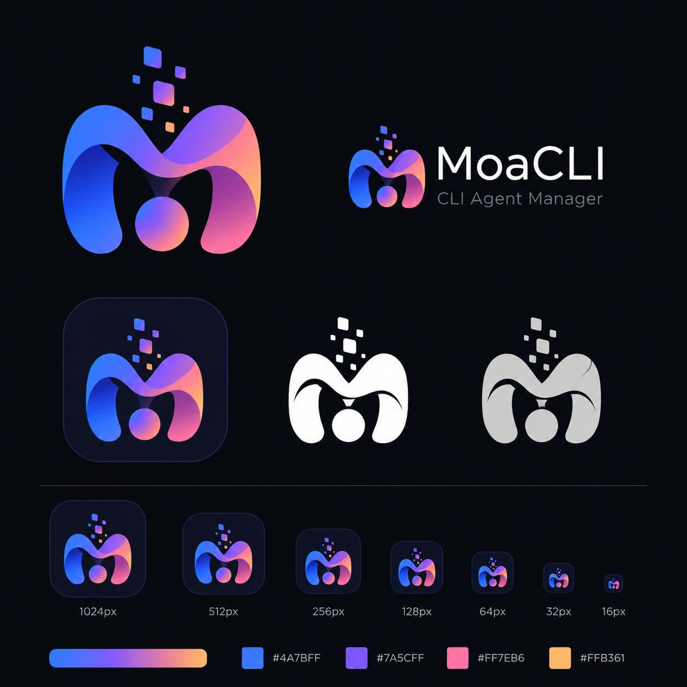

<p align="center">
  
</p>

<h1 align="center">MoaCLI</h1>

<p align="center">
  Run, organize, and resume multiple coding-agent CLIs from one Windows desktop workspace.
</p>

<p align="center">
  
  
  
  
</p>

<p align="center">
  <a href="https://github.com/shBye/moacli/releases/latest/download/MoaCLI-Setup.exe">
    
  </a>
</p>

<p align="center">
  
</p>

MoaCLI keeps the native interactive experience of each CLI while adding a shared launcher, isolated account profiles, persistent conversation organization, and fast switching between live terminals.

## Highlights

- Run real interactive CLIs through `node-pty` and xterm.js.
- Keep up to 10 terminal sessions open and switch between them without restarting a CLI.
- Resume local Claude, Codex, Gemini, and OpenCode conversations from one recent-history list.
- View the native CLI and the locally stored conversation transcript in separate tabs.
- Detect verified Claude, Codex, and Gemini accounts from their local CLI configuration.
- Isolate multiple Claude and Codex accounts with separate configuration directories.
- Organize conversations and live sessions into resizable, reorderable logical folders.
- Paste text, screenshots, and copied image files into the active CLI with `Ctrl+V`.
- Customize agent icons with monograms, Lucide icons, PNG images, and background colors.
- Preserve responsive terminal bottom anchoring during window resize and maximize operations.
- Detect installed CLI versions and refresh them without restarting MoaCLI.

## Supported Agents

| Agent | Interactive terminal | Local history and resume | Account discovery | Isolated account directory |
| --- | :---: | :---: | :---: | --- |
| PowerShell | Yes | No | Not required | Not required |
| Claude Code | Yes | Yes | Yes | `CLAUDE_CONFIG_DIR` |
| Codex | Yes | Yes | Yes | `CODEX_HOME` |
| Gemini CLI | Yes | Yes | Yes | Not currently configured |
| OpenCode | Yes | Yes | No | Not currently configured |

MoaCLI uses each agent's installed executable and native resume command. It does not replace or emulate the CLI itself.

## Quick Start

### Windows installer

[Download the latest MoaCLI installer](https://github.com/shBye/moacli/releases/latest/download/MoaCLI-Setup.exe), run it, and choose the installation directory. The installer creates Start menu and desktop shortcuts with the MoaCLI icon.

The first public build is not code-signed, so Windows SmartScreen may display an `Unknown publisher` warning.

### Run from source

Requirements:

- Windows 10 or Windows 11
- Node.js and npm
- At least one supported CLI installed and available on `PATH`

#### Install and run

```powershell
git clone https://github.com/shBye/moacli.git
cd moacli
npm.cmd install
npm.cmd run dev
```

The renderer development server uses port `5187`.

#### Build and run locally

```powershell
npm.cmd run build
npm.cmd run start:lean
```

To produce and publish the Windows installer, follow the verified [Windows Release Guide](./docs/WINDOWS_RELEASE.md).

Use the low-memory mode only when GPU acceleration is not desirable:

```powershell
npm.cmd run start:low-memory
```

If `node-pty` reports an Electron ABI mismatch after changing Electron or Node dependencies, rebuild the native module:

```powershell
npx electron-rebuild -f -w node-pty
```

## Using MoaCLI

### Start a new session

1. Select an agent and account.
2. Enter an optional session title.
3. Choose the working directory.
4. Select the logical folder where the session should appear.
5. Press **Start**.

Each live terminal remains mounted while you move between sessions. Sessions that have not been viewed for 30 minutes are removed from the in-memory session list, while the active session is retained.

### Resume a conversation

1. Select a conversation under **Recent**.
2. MoaCLI opens the matching account, working directory, and native resume ID.
3. Use the **CLI** tab to continue working or **Conversation** to read the local transcript.

Recent conversations are read from the CLI-owned local history. If a conversation is removed through its original CLI, MoaCLI reconciles the list on the next history refresh.

### Use multiple accounts

Open **Settings**, add an account, select the agent, and assign a dedicated configuration directory. Accounts are identified by the combination of agent type and normalized configuration directory, so Claude and Codex may use the same email without colliding.

The email is display metadata. Authentication is controlled by the official CLI state inside the selected configuration directory. A single directory cannot hold two simultaneous identities for the same agent; signing in again replaces that directory's active credentials.

Automatically detected accounts are read-only. Manually added profiles can be edited or removed. After browser login, use the refresh action next to the login session close button to verify and update the account email.

### Paste images

Press `Ctrl+V` inside the terminal:

- Clipboard text is inserted as text.
- A copied bitmap is saved as a temporary PNG and inserted as a quoted path.
- Image files copied from Windows Explorer are inserted as quoted paths.
- Enter is never sent automatically.

## Security and Privacy

- MoaCLI does not ask for or store passwords, OAuth tokens, or API keys.
- Authentication is performed by the installed official CLI.
- Account discovery exposes only verified email metadata to the renderer.
- Conversation history stays on the local machine and is read from CLI-owned files.
- Custom account directories are passed only to the matching CLI process.

## Architecture

```text
src/
  App.tsx             React application state and desktop workflows
  history/            Local conversation transcript UI
  terminal/           xterm.js wrapper, resize handling, IME, clipboard input

electron/
  main.ts             BrowserWindow lifecycle and IPC handlers
  preload.ts          Typed renderer-to-main API boundary
  pty-manager.ts      PTY lifecycle, isolated environments, output batching
  session-history.ts  Account inspection and agent-specific history adapters
  agent-profiles.ts   CLI discovery, version checks, and Windows launch wrappers

profiles/
  agents.default.json Agent commands, login arguments, and resume arguments
```

The renderer is built with React 18 and TypeScript. Privileged filesystem, process, clipboard, and PTY operations remain behind the Electron preload boundary.

## Roadmap

| Feature | Status | Development branch |
| --- | --- | --- |
| Unified notification center | Planned | [`feature/notification-center`](https://github.com/shBye/moacli/tree/feature/notification-center) |
| Session restoration after restart | Planned | [`feature/session-restore`](https://github.com/shBye/moacli/tree/feature/session-restore) |
| Full conversation search with SQLite FTS5 | Planned | [`feature/conversation-search`](https://github.com/shBye/moacli/tree/feature/conversation-search) |

The detailed product flow, data model, failure handling, and acceptance criteria are documented in [ROADMAP.md](./ROADMAP.md). Completed work and resolved implementation issues are tracked in [PROGRESS.md](./PROGRESS.md).

## Scripts

| Command | Purpose |
| --- | --- |
| `npm.cmd run dev` | Start Electron with the development renderer |
| `npm.cmd run typecheck` | Run TypeScript checks without emitting files |
| `npm.cmd run build` | Type-check and build main, preload, and renderer bundles |
| `npm.cmd run start:lean` | Run the production build with GPU acceleration |
| `npm.cmd run start:low-memory` | Run the production build with GPU acceleration disabled |
| `npm.cmd run package` | Build a distributable Electron package |

## Fonts and Branding

MoaCLI uses Inter Variable for the application UI and JetBrains Mono Variable for terminals. Their OFL license files are included under `src/assets/fonts/`. The application icon and brand artwork are stored in `src/assets/` and `docs/assets/`.
