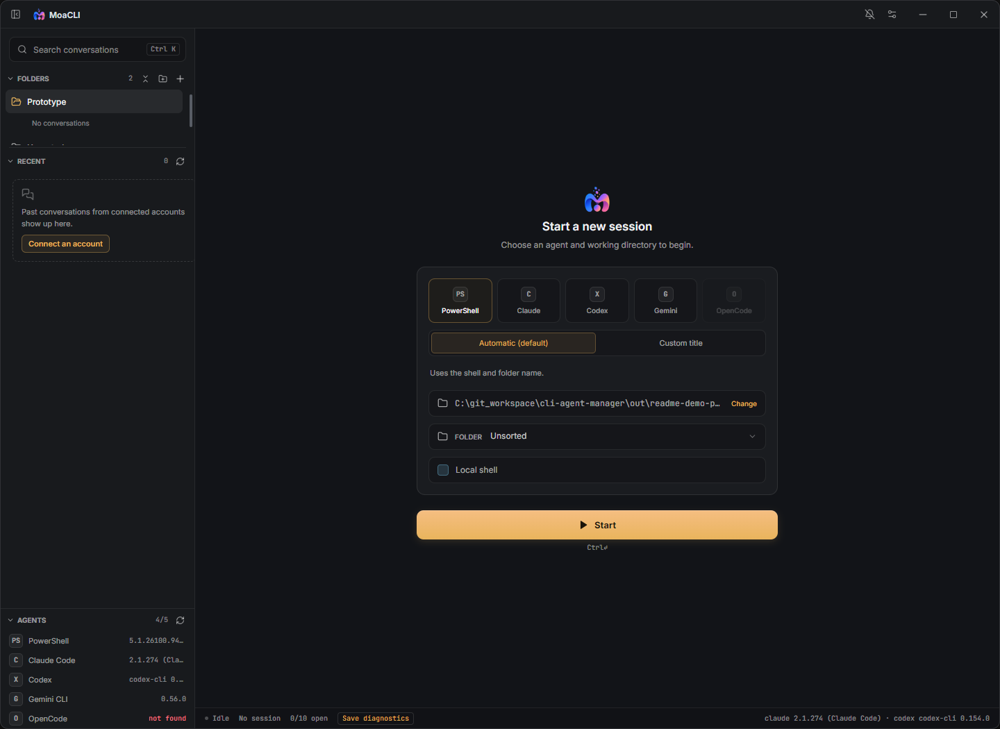

# MoaCLI 처음 사용하기

MoaCLI는 Claude Code·Codex·Gemini CLI·OpenCode를 한 창에서 실행하고, 여러 작업과 대화 기록을 관리하는 Windows 앱입니다. AI CLI는 별도로 설치하고 로그인해야 합니다. 우선 PowerShell만 열어 앱을 둘러볼 수도 있습니다.

[설치파일 받기](https://github.com/shb990407-cyber/moacli/releases/latest/download/MoaCLI-Setup.exe) · [Tasks 자세히 보기](./TASKS_GUIDE_KO.md) · [README](../README.md)

## 1. 사용할 CLI 준비

현재 배포 대상은 Windows 10/11 x64입니다. macOS는 계획 단계입니다.

원하는 CLI 하나를 공식 안내에 따라 설치하고, Windows 터미널에서 실행해 로그인 또는 제공자 설정을 완료하세요.

| CLI | 공식 안내 | PowerShell에서 설치 확인 |
| --- | --- | --- |
| Claude Code | [시작 안내](https://code.claude.com/docs/en/quickstart) | `claude --version` |
| Codex | [CLI 안내](https://developers.openai.com/codex/cli/) | `codex --version` |
| Gemini CLI | [설치 안내](https://geminicli.com/docs/get-started/installation/) | `gemini --version` |
| OpenCode | [시작 안내](https://opencode.ai/docs/) | `opencode --version` |

네 가지를 모두 설치할 필요는 없습니다. WSL 안에만 설치했다면 Windows용 MoaCLI에서 감지되지 않을 수 있습니다. 모델 사용 권한·사용량·요금은 각 CLI와 제공자의 계정 설정을 따릅니다.

## 2. MoaCLI 설치

설치파일을 실행한 뒤 시작 메뉴나 바탕화면의 **MoaCLI**를 여세요. 일반 사용자는 Git 저장소를 복제하거나 MoaCLI 실행을 위해 Node.js를 따로 설치할 필요가 없습니다. 선택한 CLI 자체의 설치 요건은 별개입니다.

현재 설치파일은 코드 서명되지 않아 Windows에 **Unknown publisher**가 표시될 수 있습니다.

## 3. 첫 세션 시작

1. **Start a new session**에서 설치된 에이전트를 선택합니다. AI 로그인 없이 확인하려면 **PowerShell**을 선택하세요.
2. 제목은 **Automatic (default)**으로 두면 됩니다. 직접 고정할 이름이 있으면 **Custom title**을 선택하고 입력하세요.
3. 경로 옆 **Change**를 눌러 실제 작업할 프로젝트 폴더를 고릅니다.
4. **Folder**는 우선 **Unsorted**로 둡니다. 이는 사이드바 분류이며, 파일이 있는 실제 작업 경로와 다릅니다.
5. 계정을 선택합니다. 연결된 계정이 없다면 **No account connected yet — set one up**에서 설정을 확인하세요. PowerShell은 계정이 필요 없습니다.
6. **Start**를 누릅니다. CLI가 표시하는 신뢰·로그인 안내를 마친 뒤 **CLI** 탭에서 질문을 입력하세요.

처음에는 “파일은 수정하지 말고 이 프로젝트의 폴더 구조를 설명해줘”처럼 간단히 시작해 보세요. PowerShell에서는 `Get-Location`으로 작업 경로를 확인할 수 있습니다.

v0.1.35 Windows 앱을 별도 데모 설정으로 실행한 실제 화면입니다. PowerShell 예시는 AI 계정 없이 사용할 수 있습니다.

## 4. 화면 구분

| 화면 | 하는 일 |
| --- | --- |
| **CLI** | 실제 에이전트와 대화하고, 질문에 답하거나 명령 실행을 승인합니다. |
| **Conversation** | CLI가 로컬에 저장한 대화 내용을 읽습니다. 실시간 출력보다 늦게 반영될 수 있습니다. |
| **Tasks** | AI 에이전트 세션에서 변경사항 분석과 위임 작업을 확인합니다. PowerShell에는 표시되지 않습니다. [상세 안내](./TASKS_GUIDE_KO.md) |
| **Folders** | 세션을 분류합니다. 분류를 옮겨도 프로젝트 파일은 이동하지 않습니다. |
| **Recent** | 저장된 대화를 찾아 다시 엽니다. |
| **알림 아이콘** | 지원되는 승인·입력 요청과 작업 결과 알림을 확인합니다. |

**+ / New session**으로 세션을 더 열 수 있으며 최대 10개의 터미널을 유지합니다. 탭을 바꿔도 실행 중인 CLI는 계속 동작합니다. 앱을 종료하면 CLI 프로세스는 종료되므로, 다시 실행했을 때는 **Recent → 해당 대화 → CLI**에서 이어가세요.

`Ctrl+K`는 Claude·Codex의 저장된 메시지 검색입니다. 두 글자 이상 입력하고 결과를 고르면 해당 대화 위치를 엽니다. 검색 결과를 읽는 것만으로 CLI가 실행되지는 않습니다.

## 5. 처음 확인할 설정

- **Settings → Accounts**: 사용할 계정과 설정 디렉터리를 확인합니다. 이메일 표시만 바꾼다고 로그인 계정이 바뀌지는 않습니다. 여러 Claude·Codex 계정을 쓸 때는 계정별 설정 디렉터리를 분리하세요.
- **Settings → Notifications**: 필요한 알림 종류를 선택합니다. 에이전트와 CLI 버전에 따라 감지 가능한 이벤트가 다릅니다.
- **Codex의 `/hooks`**: MoaCLI에서 시작한 Codex 0.154.0 이상 세션에서는 MoaCLI observer 항목을 확인하고 신뢰해야 상세 상태 알림을 받을 수 있습니다. 아직 신뢰되지 않았다면 **Status unconfirmed** 또는 일반적인 주의 알림만 표시될 수 있습니다.
- **Settings → CLI permissions**: Codex 권한 선택은 다음 새 세션 또는 재개 시 적용됩니다. **Full access**는 명령 승인과 샌드박스 제한을 없애는 선택이며, 이미 실행 중인 세션·훅 신뢰·위임 워커 권한을 동시에 바꾸지 않습니다.
- **Settings → Delegation**: 다른 에이전트에 작업을 맡길 때 설정합니다. 첫 대화를 시작하는 데 필수는 아닙니다.
- **Settings → Updates**: 새 릴리즈를 확인하고 설치파일을 받습니다. MoaCLI 업데이트가 개별 CLI까지 업데이트하지는 않습니다.

## 문제가 생겼을 때

| 증상 | 먼저 해볼 일 |
| --- | --- |
| 에이전트가 비활성화되거나 not found 표시 | 새 PowerShell에서 버전 명령을 실행하고 설치/PATH를 확인하세요. 앱의 **Refresh CLI versions**를 누르거나 PATH 변경 후 앱을 재시작하세요. |
| 대화 내용이 최신이 아님 | **CLI**의 실시간 출력과 구분하세요. CLI가 기록을 저장한 뒤 **Recent**를 새로고침하세요. |
| 재실행했더니 작업이 진행되지 않음 | 실행 중이던 프로세스는 복원되지 않습니다. **Recent**에서 저장된 대화를 다시 열어 **CLI**로 이어가세요. |
| Tasks에 작업이 안 보임 | 변경사항 분석인지 CLI 위임인지 구분하고 [Tasks 안내](./TASKS_GUIDE_KO.md)를 확인하세요. |
| 한글 입력 지연·화면 위로 튐 | 발생 직후 하단 **Save diagnostics**로 저장하고, 앱/CLI 버전·실행 중인 세션 수·직전 동작을 함께 기록하세요. |

진단 파일은 자동 업로드되지 않습니다. 버그 보고용 스크린샷에는 계정이나 프로젝트 내용이 보일 수 있으므로 첨부 전 확인하세요. [이슈 작성](https://github.com/shb990407-cyber/moacli/issues) · [진단 기록 설명](./TERMINAL_DIAGNOSTICS.md)
