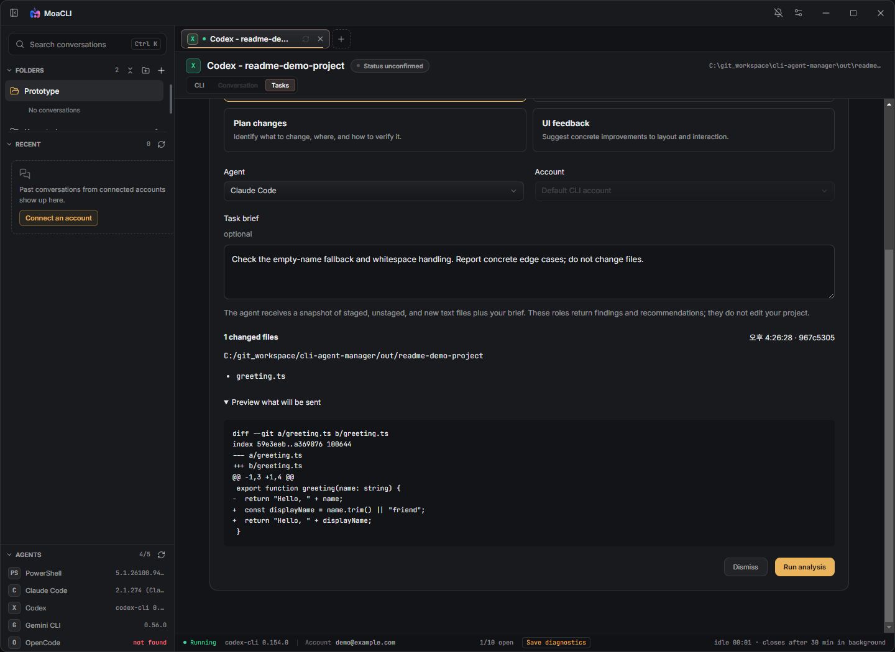

# Tasks 사용 안내

**변경한 코드를 다른 에이전트에게 검토받고 싶다면 `Analyze Git changes`부터 사용하세요.** 원래 대화 중인 에이전트가 다른 에이전트에게 일을 맡긴 경우에는 `Delegated by this CLI`에 표시됩니다.

[처음 사용하기](./GETTING_STARTED_KO.md) · [README의 Tasks 안내](../README.md#tasks-analyze-changes-or-delegate-work)

## 두 가지 작업의 차이

| 구분 | Analyze Git changes | Delegated by this CLI |
| --- | --- | --- |
| 누가 시작하나요? | 사용자가 미리보기 후 **Run analysis** 클릭 | 연결된 원래 CLI가 MoaCLI 위임 도구 호출 |
| 무엇을 전달하나요? | 캡처한 미커밋 텍스트 변경사항과 **Task brief** | 위임 요청에 포함된 작업 설명과 지정 작업 경로 |
| 기존 대화를 공유하나요? | 원래 대화 전체를 공유하지 않음 | 원래 대화 전체를 자동 복사하지 않음 |
| 파일을 수정하나요? | 수정하지 않고 분석 결과 반환 | 분석 모드는 분석만, 편집 모드는 프로젝트 파일 변경 가능 |
| 결과를 어디서 보나요? | **Task history** | **Delegated by this CLI**의 작업 카드 |

두 기능 모두 별도의 CLI 워커를 실행합니다. 선택한 에이전트의 계정과 사용량이 적용되며, 대화 중인 모델이 자동으로 그대로 복제되는 것은 아닙니다.

v0.1.35 실제 앱에서 샘플 Git 프로젝트와 예시 계정명으로 캡처했습니다. 그림으로 만든 시안이나 AI 분석 완료 화면이 아닙니다. 개인정보가 있는 계정·대화 기록은 불러오지 않았고, 분석 요청은 보내지 않았습니다.

## 1. 변경사항 분석: 가장 간단한 시작

### 준비

- Git이 설치되어 있고, 세션의 작업 경로가 Git 저장소 안이어야 합니다.
- Tasks는 AI 에이전트 세션에 표시됩니다. PowerShell 세션에는 표시되지 않습니다.
- 저장소에 첫 커밋이 있어야 합니다.
- 아직 커밋하지 않은 텍스트 변경사항이 있어야 합니다. 이미 커밋한 코드 전체를 분석하는 버튼은 아닙니다.
- 사용할 Claude·Codex·Gemini·OpenCode CLI가 설치되고 사용 가능한 상태여야 합니다. 워커별 버전 조건은 [호환성 문서](./DELEGATION_EXPANSION.md#compatibility-and-limits)를 확인하세요.

### 실행 순서

1. 해당 세션의 **Tasks** 탭을 엽니다. **Session folder**가 검토할 프로젝트 경로인지 확인하세요.
2. **Preview Git changes**를 누릅니다. 스테이징된 변경, 스테이징되지 않은 변경, 무시되지 않은 새 텍스트 파일을 캡처합니다. 이 버튼만 누른 상태에서는 분석 요청을 보내지 않습니다.
3. 역할·**Agent**·**Account**를 선택합니다. 다른 에이전트의 관점을 원하면 현재 CLI와 다른 에이전트를 선택하세요.
4. **Task brief**에 목적과 기대 동작을 적습니다. 원래 대화를 모르는 워커가 읽으므로 “방금 말한 문제” 대신 구체적인 조건과 대상 파일을 적어주세요.
5. **Preview what will be sent**를 펼쳐 파일 목록과 변경 내용을 확인합니다.
6. **Run analysis**를 누릅니다. 이 클릭이 실행 승인에 해당하며 별도의 위임 승인창은 뜨지 않습니다. 선택한 계정과 저장된 기본 워커 모델을 사용합니다.
7. 실행 중에는 다른 탭에서 작업해도 됩니다. 완료 후 **Task history**에서 결과를 확인하세요.

**Preview what will be sent**를 펼친 실제 화면입니다. 아래 **Run analysis**를 누르기 전까지 파일과 패치를 확인할 수 있습니다.

예시 Task brief:

> 업로드 도중 취소했을 때 임시 파일과 이벤트 리스너가 정리되는지 검토해줘. 정상 완료 경로보다 취소·오류 경로를 중점적으로 확인하고, 근거가 있는 문제만 알려줘.

### 역할 선택

| 역할 | 적합한 요청 |
| --- | --- |
| **Code review** | “이 변경에 실제 버그나 기존 동작이 깨지는 부분이 있는지 확인해줘.” |
| **Investigate** | “이 조건에서 문제가 생기는 원인 후보와 확인 방법을 정리해줘.” |
| **Plan changes** | “어떤 파일을 어떤 순서로 바꾸고 어떻게 검증할지 계획해줘.” |
| **UI feedback** | “제공된 UI 코드 변경에서 사용성·접근성 개선점을 찾아줘.” |

여기서 **Plan changes**도 파일을 수정하지 않습니다. **UI feedback**은 전달한 변경 내용을 보고 답하며, 실행 중인 앱 화면을 자동 촬영하거나 보는 기능은 아닙니다. 분석 대상은 캡처한 변경사항이므로 전체 프로젝트 조사에 필요한 맥락은 부족할 수 있습니다.

### 결과를 실제 수정 요청으로 연결

1. 결과에서 반영할 항목의 체크박스를 선택합니다.
2. **Draft revision request**로 수정 요청 초안을 만듭니다.
3. 초안을 읽고 필요한 조건이나 제외할 내용을 수정합니다.
4. **Copy draft**로 복사하거나 **Insert into CLI**로 원래 CLI에 넣습니다.
5. **자동 전송되지는 않습니다.** 원래 CLI에서 확인한 뒤 Enter를 눌러 요청하세요.

구조화된 항목이 없는 일반 응답이면 **Use response as draft**를 사용할 수 있습니다. **Insert into CLI**가 비활성화되어 있으면 원래 CLI를 열고 대기 중인 상호작용을 먼저 마치세요. 결과를 읽거나 초안을 만드는 것만으로 프로젝트 파일이 바뀌지는 않습니다.

### 미리보기와 제한

- 미리보기 후 파일이 달라지면 실행 전에 다시 캡처해야 합니다. 15분이 지난 미리보기도 새로고침해야 합니다.
- 분석 시작 이후의 편집은 이미 실행된 분석에 포함되지 않습니다. 새 변경을 검토하려면 다시 미리보기를 만드세요.
- 바이너리 파일과 지나치게 큰 패치는 거부됩니다. 이미지·설치파일 같은 생성물은 별도로 검토하고, 불필요한 생성물이 새 파일로 잡힌 경우 프로젝트의 `.gitignore`를 확인하세요.
- 이미 Git이 추적 중인 바이너리는 `.gitignore`에 추가하는 것만으로 변경사항에서 빠지지 않습니다. 분석 때문에 원본 파일을 무작정 삭제하거나 변경사항을 버리지 마세요.

## 2. 대화 중인 CLI에서 다른 워커에게 위임

### 연결

1. **Settings → Delegation → Enabled**를 켭니다.
2. 상태가 **Listening on 127.0.0.1:…**인지 확인합니다.
3. 그 이후 MoaCLI에서 **Claude 또는 Codex 세션을 새로 시작하거나 재개**합니다. 기존에 실행 중이던 CLI는 다시 열어야 연결됩니다.

MoaCLI 안에서 시작하는 Claude·Codex 세션은 자동 연결됩니다. 설정에 표시되는 등록 명령과 설정 조각은 앱 외부의 터미널을 연결할 때 사용하는 고급 설정입니다. 처음부터 복사할 필요는 없습니다.

Claude·Codex가 요청하는 워커로는 Claude·Codex·Gemini·OpenCode를 선택할 수 있습니다. “Gemini를 워커로 지원한다”와 “Gemini 대화 세션도 자동으로 위임 도구에 연결된다”는 다른 기능입니다.

### 요청 예시

원래 CLI에 다음처럼 요청할 수 있습니다.

> MoaCLI 위임 도구를 사용해서 Codex에게 업로드 취소 처리의 읽기 전용 검토를 맡겨줘. 기대 동작과 관련 파일 경로를 요청에 포함하고, 파일 수정은 하지 않도록 해줘. 결과를 받으면 네가 타당성을 확인해줘.

단순히 다른 에이전트를 언급하는 것만으로 작업이 생기지는 않습니다. 원래 CLI가 실제로 MoaCLI 도구를 호출해야 작업 목록에 표시됩니다. 작업 범위와 모드를 분명히 전달하세요.

### 승인과 모델

자동 승인이 꺼져 있으면 **Review request**에서 다음을 확인합니다.

- 작업 설명, 작업 경로, 시간 제한
- **Analysis only**인지 파일 변경이 가능한 작업인지
- 사용할 계정과 모델

기본 모델을 쓰려면 **Use default setting**, 이번 작업만 바꾸려면 **Change for this task**를 선택합니다. **Allow …**로 승인하거나 **Decline**으로 거절합니다. 창을 닫으면 결정이 보류됩니다.

| 설정 | 적용 범위 |
| --- | --- |
| **Default worker models** | 에이전트별 기본 워커 모델 |
| 승인창의 **Change for this task** | 해당 작업 하나의 모델 |
| **Auto-approve analysis** | 새 분석 위임을 별도 창 없이 승인 |
| **Auto-approve file edits** | 새 파일 편집 위임도 별도 창 없이 승인. 기본값은 꺼짐 |

자동 승인 작업은 저장된 기본 모델을 사용합니다. Claude·Codex·Gemini는 목록 선택, OpenCode는 `provider/model` 직접 입력을 지원하며 **CLI default**도 선택할 수 있습니다. 목록은 계정별 사용 가능성을 보장하지 않습니다.

이 설정은 **워커 모델**에 관한 것입니다. 현재 대화 중인 CLI의 모델이나 CLI 명령 승인 설정을 함께 바꾸지는 않습니다. 직접 누른 **Run analysis**는 기본 워커 모델을 사용하므로, 그 모델을 바꾸려면 실행 전에 **Settings → Delegation**에서 저장하세요.

### 진행 상태와 결과

| 상태 | 의미와 다음 행동 |
| --- | --- |
| **Awaiting approval** | 아직 실행되지 않았습니다. **Review request**에서 결정하세요. |
| **Queued** | 승인됐지만 워커 자리 또는 같은 영역의 편집 작업 종료를 기다립니다. |
| **Running** | 워커가 실행 중입니다. 다른 탭으로 이동해도 진행됩니다. |
| **Completed** | 결과를 펼쳐 읽고, 원래 CLI에서 통합·검증하세요. |
| **Failed** | 오류 내용을 확인하세요. 인증·모델·버전·시간 제한 등을 구분해야 합니다. |
| **Declined / Cancelled** | 거절되거나 취소된 작업입니다. |

최대 3개의 작업을 동시에 실행하며, 작업 경로가 겹치는 편집은 순서대로 진행합니다. 편집 워커는 실제 프로젝트 파일을 바꿀 수 있으므로 다른 CLI에서 같은 파일을 동시에 수정하지 않는 편이 좋습니다. **Cancel task는 이미 변경한 파일을 되돌리는 기능이 아닙니다.**

Gemini·OpenCode 워커는 파일 도구 범위에서 동작하고 셸 명령·테스트 실행은 원래 에이전트에 남습니다. 워커 결과의 **Completed**가 프로젝트 전체 검증 완료를 의미하지는 않습니다.

세션의 **Delegated by this CLI**에는 연결된 최신 작업 30개가 표시됩니다. 외부 터미널에서 등록해 만든 작업은 **Settings → Delegation**의 전역 작업 목록에서 확인하세요.

## 자주 막히는 경우

| 문제 | 확인할 내용 |
| --- | --- |
| Git 저장소가 아니라는 오류 | 세션의 실제 작업 경로를 확인하세요. **Preview Git changes**는 일반 질문 실행 버튼이 아닙니다. |
| 변경사항 없음 | 현재 커밋 이후 미커밋 변경을 분석합니다. 이미 커밋한 변경은 대상에 포함되지 않습니다. |
| 미리보기 만료 또는 파일 변경 오류 | 편집이 끝난 뒤 **Preview Git changes**를 다시 누르세요. |
| 위임 목록이 비어 있음 | 서버 활성화 후 Claude/Codex를 열었는지, 실제 MoaCLI 위임 도구가 호출됐는지 확인하세요. |
| 모델이 없거나 인증 오류 | 해당 CLI/계정의 로그인과 모델 접근을 확인하세요. 계정별 모델 제한이 있을 수 있습니다. |
| Queued에서 기다림 | 다른 작업 3개가 실행 중인지, 겹치는 편집 작업이 있는지 확인하세요. |
| 결과에 원래 대화의 맥락이 없음 | 대화 전체는 자동 공유되지 않습니다. Task brief 또는 위임 요청에 필요한 맥락을 적어주세요. |

구현과 호환성 세부 사항: [모델 선택](./DELEGATION_MODELS.md) · [워커 범위와 제한](./DELEGATION_EXPANSION.md)
